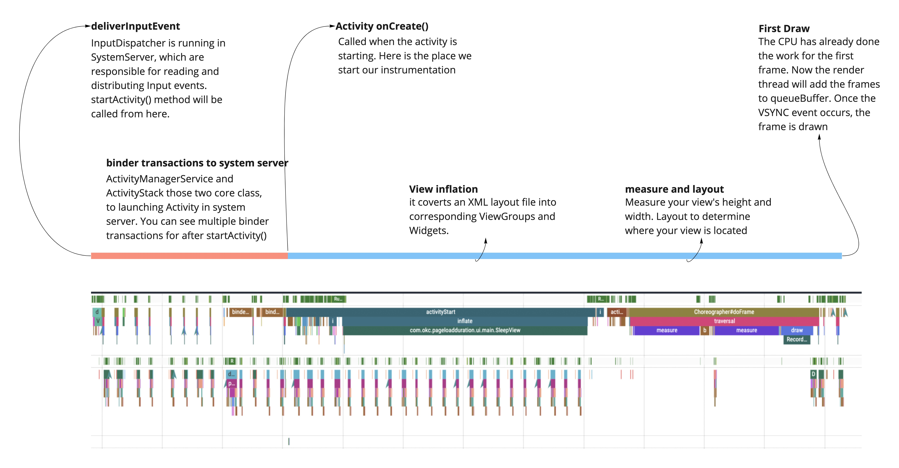
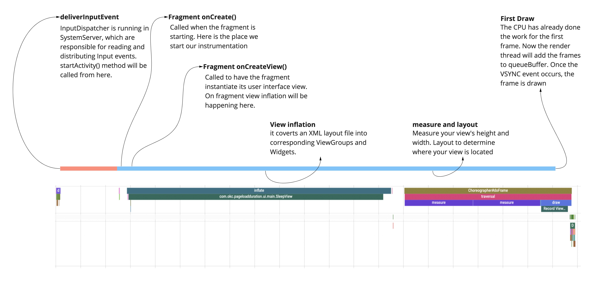
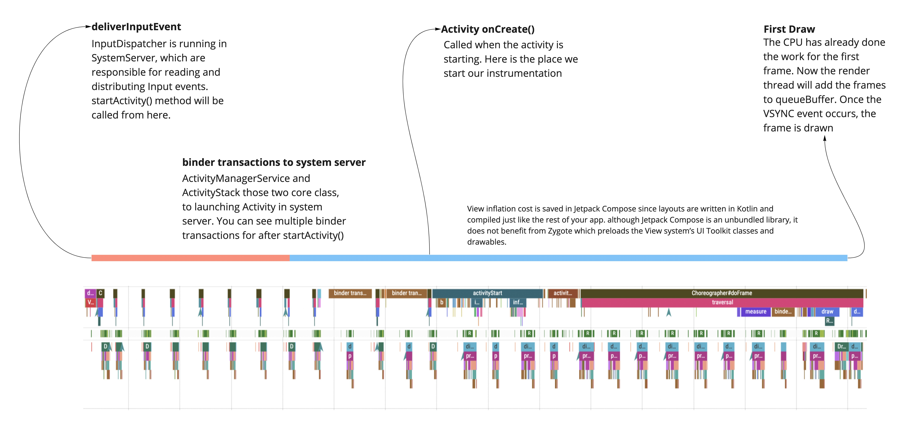

Page load time is an important metric for web pages. This metric received little attention on mobile devices. According to data from the [UX research](https://web.dev/rail/#50-ms-or-100-ms) response time shorter than 100ms feels instant. So the goal is to maintain this metric below 100.

### What is page load time?
We define Page load time as the duration between creating an activity (Activity/Fragment) to the first draw of the screen. During this period, view inflation and measure traversal will occur.

### Gradle Setup

```gradle
repositories {
    maven { url 'https://jitpack.io' }
}

dependencies {
    implementation 'com.github.okcredit:android-page-load-instrumentation:alpha-1.0'
}
```

### Usage
Add `window.decorView.firstDrawListener(lifecycleScope)` at the start of onCreate() in Activity/Fragment. It should be called before super.onCreate(). On the next onDraw of the view, the callback is invoked.

```
import androidx.lifecycle.lifecycleScope


class YourActivity : AppCompatActivity() {

    override fun onCreate(savedInstanceState: Bundle?) {
        val activityCreateTime = System.currentTimeMillis()
        window.decorView.firstDrawListener(lifecycleScope) {
            Log.d("PageLoad", "Duration=${System.currentTimeMillis() - activityCreateTime}")
        }

        super.onCreate(savedInstanceState)
        ...
    }
}
```


### An overview of screen loading

#### Activity



#### Fragment



#### Compose Activity



### Acknowledgements

- Thanks to [py - Pierre Yves Ricau](https://github.com/pyricau) for this detailed [article series](https://dev.to/pyricau/android-vitals-what-time-is-it-2oih).

### License

    Copyright 2022 OkCredit.

    Licensed under the Apache License, Version 2.0 (the "License");
    you may not use this file except in compliance with the License.
    You may obtain a copy of the License at

       http://www.apache.org/licenses/LICENSE-2.0

    Unless required by applicable law or agreed to in writing, software
    distributed under the License is distributed on an "AS IS" BASIS,
    WITHOUT WARRANTIES OR CONDITIONS OF ANY KIND, either express or implied.
    See the License for the specific language governing permissions and
    limitations under the License.
